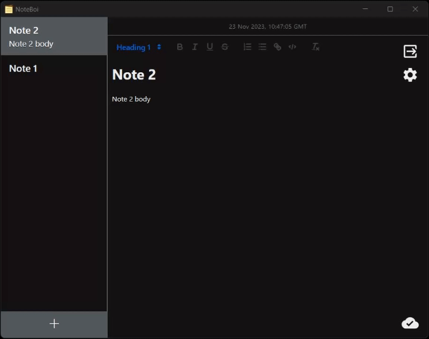

# NoteBoi

An app for syncing notes across multiple devices.

## Features

- [x] Remote storage/backup
- [x] E2E encryption
- [x] WYSIWYG editor
- [x] Light/dark themes
- [ ] Mobile support (planned)

## Installation

Go to the [releases page](https://github.com/Daniel-Knights/note-boi/releases) and download the appropriate installer.

- MacOS: `.dmg`, `.app`
- Windows: `.msi`, `-setup.exe`
- Linux: `.deb`, `.AppImage`
