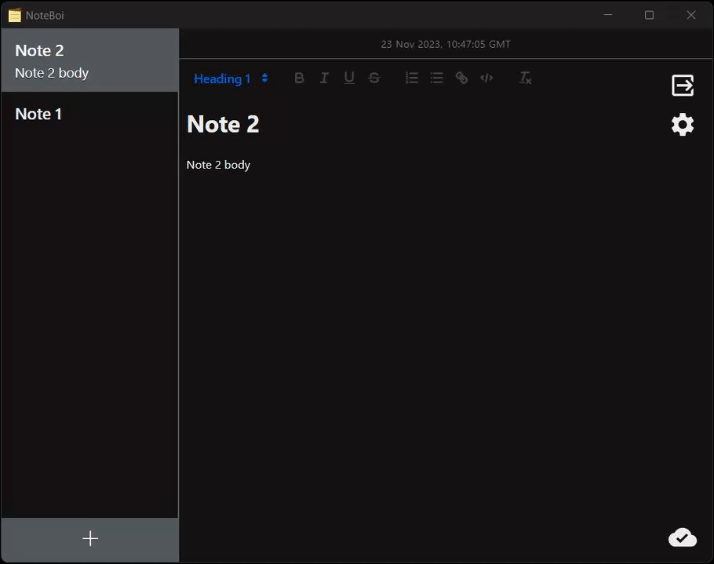

# NoteBoi

An app for syncing notes across multiple devices.

## Features

- [x] Remote storage
- [x] Local backups
- [x] E2E encryption
- [x] Rich text editor
- [x] Web
- [x] Mobile
- [x] Find in page
- [x] Light/dark themes

## Usage

### Web

[Click here](https://dk-tetris.netlify.app/).

### Mobile

[Follow the instructions here](https://www.installpwa.com/from/note-boi.netlify.app).

### Desktop

Go to the [releases page](https://github.com/Daniel-Knights/note-boi/releases) and download the appropriate installer.

- MacOS: `.dmg`, `.app.tar.gz`
- Windows: `.msi`, `-setup.exe`
- Linux: `.deb`, `.AppImage`, `.rpm`

## Server status

| Server | Status     |
| ------ | ---------- |
| v1     | 🔴 Offline |
| v2     | 🔴 Offline |
| v3     | 🔴 Offline |
| v4     | 🟢 Online  |

## Troubleshooting

### NoteBoi Is Damaged and Can’t Be Opened. You Should Move It To The Trash

Open your terminal and run `xattr -c /Applications/NoteBoi.app`.

https://discussions.apple.com/thread/253714860?sortBy=best
